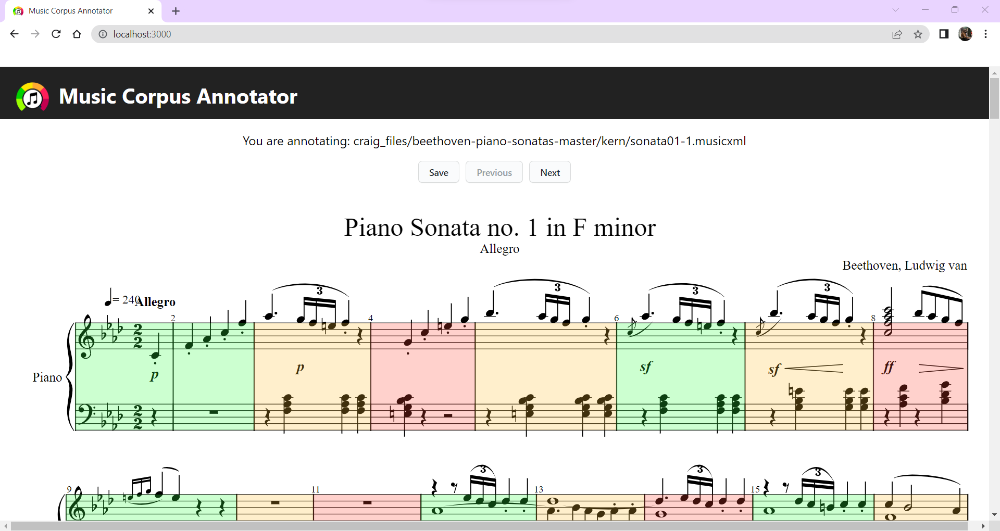

> "Eello World example": Create-React-App (CRA) and Eel

**Table of Contents**

<!-- TOC -->

- [07 - CreateReactApp Documentation](#07---createreactapp-documentation)
    - [Quick Start](#quick-start)
    - [About](#about)
    - [Main Files](#main-files)

<!-- /TOC -->

# Music Corpus Annotator Documentation

Music Corpus Annotator is an app to annotate the difficulty of music scores. This particular project was generated from 
the eel example https://github.com/python-eel/Eel/tree/main/examples/07%20-%20CreateReactApp.

If you run into any issues with the app, open a [new issue](https://github.com/nereasastre/Music_Corpus_Annotator/issues) and tag @nereasastre

## Usage
Music Corpus Annotator allows the user to annotate the difficulty of music scores. Some functionalities and buttons that control them:
- **Annotate**: The current score is highlighted in gray. To annotate such score, just press 1 (easy), 2 (medium) or 3 (hard) 
in your keyboard. This will render a green, orange or red box, depending on the chosen difficulty.
- **Annotate with the mouse**: In order to annotate multiple boxes at once, press que shift button + the annotation (1, 2, 3 key). 
  Then, hold the shift key and click on the first score that you wish to annotate. Drag until the last score to annotate and release the mouse click. This will render a box from the 
  first score you clicked on to the score where you released the mouse button. 
- **Select a box**: In order to move to another box without annotating, just use the arrow keys (left to move backwards, right
  to move forward). This will update the select box.
- **Go to the next/previous score**: In order to render the next score, press the "Next" button. To render the previous score,
press the "Previous" button.
- **Save annotations**: If you want to save your annotations to a .json file, press the "Save" button. This is not mandatory, since
as saving is automatically triggered before closing the page, and before rendering the next/previous score.

This is what the application will look like after some annotations:


That is it! Please also bear in mind that the application is currently slow. I am actively trying to improve this inconvenience.


## Quick Start
Clone the repository to use the app. Run `git clone https://github.com/nereasastre/Music_Corpus_Annotator/`

1. **Configure:** In the app's directory, run `npm install` and `pip install bottle bottle-websocket future whichcraft pyinstaller`
2. **Demo:** Build static files with `npm run build` then run the application with `python eel_CRA.py`. A Chrome-app window should open running the built code from `build/`
3. **Distribute:** (Run `npm run build` first) Build a binary distribution with PyInstaller using `python -m eel eel_CRA.py build --onefile --name Music_Corpus_Annotator` (See more detailed PyInstaller instructions at bottom of [the main README](https://github.com/ChrisKnott/Eel))
4. **Develop:** Open two prompts. In one, run  `python eel_CRA.py true` and the other, `npm start`. A browser window should open in your default web browser at: [http://localhost:3000/](http://localhost:3000/). As you make changes to the JavaScript in `src/` the browser will reload. Any changes to `eel_CRA.py` will require a restart to take effect. You may need to refresh the browser window if it gets out of sync with eel.


## Main Files

Critical files for this app:

- `src/App.tsx`: Main application file for annotating
- `eel_CRA.py`: Basic `eel` file
  - If run without arguments, the `eel` script will load `index.html` from the build/ directory (which is ideal for building with PyInstaller/distribution)
  - If any 2nd argument (i.e. `true`) is provided, the app enables a "development" mode and attempts to connect to the React server on port 3000
  - Used to edit and save local files
- `public/index.html`: Added location of `eel.js` file based on options set in eel_CRA.py

  ```html
  <!-- Load eel.js from the port specified in the eel.start options -->
  <script type="text/javascript" src="http://localhost:8080/eel.js"></script>
  ```

- `src/react-app-env.d.ts`: This file declares window.eel as a valid type for tslint. Note: capitalization of `window`
- `src/App.css`: Added some basic button styling
- `src/boundingBoxes.tsx`: Contains functions used for rendering difficulty bounding boxes.


