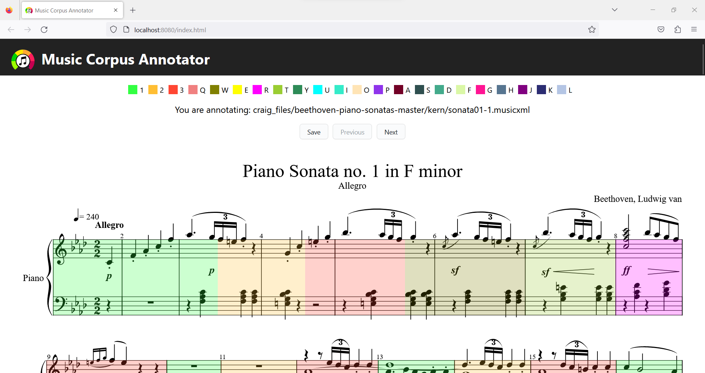

**Table of Contents**

<!-- TOC -->

- [Music Corpus Annotator Documentation](#music-corpus-annotator-documentation)
    - [Usage](#usage)
    - [Quick start](#quick-start)
    - [Main Files](#main-files)

<!-- /TOC -->

# Music Corpus Annotator Documentation

Music Corpus Annotator is an app to annotate the difficulty of music scores. This particular project was generated from 
the eel example https://github.com/python-eel/Eel/tree/main/examples/07%20-%20CreateReactApp.

If you run into any issues with the app, open a [new issue](https://github.com/nereasastre/Music_Corpus_Annotator/issues) and tag @nereasastre

## Usage
Music Corpus Annotator allows the user to annotate the difficulty of music scores. Some functionalities and buttons that control them:
- **Annotate**: On start, the current measure is highlighted in gray. To annotate that entire measure, just press 1, 2, 3 or the 19 keys in the keyboard from the letters Q to L. 
  This will highlight the measure with the color of the key that has been pressed (see legend in the main page).
- **Annotate with the mouse**: In order to annotate from a coordinate to another one with the mouse, press que shift button + the annotation (1, 2, 3 or Q-L). 
  Then, hold the shift key and click on the first note that you wish to annotate. Drag until the last note to annotate and release the mouse click. This will render a box from the 
  first note that has been clicked on to the note where the mouse button was released. If instead of highlighting from note to note you want to highlight
  all the measures entirely from the first to the last position, you can use the "Alt" key instead of Shift, and proceed as with Shift.
- **Select a box**: In order to move to another box without annotating, use the arrow keys (left to move backwards, right
  to move forward). This will update the select box. If you cannot see the select box, press the Period "." key, and it will appear again.
- **Delete a measure**: To delete the annotations from the last annotated measure, use the Backspace button. If you want to delete a measure 
  that is not the last one, go to the measure using the arrow keys. Once it is highlighted in gray, press the Backspace key.
- **Go to the next/previous score**: In order to go to the next score in index.json, press the "Next" button. To render the previous score,
press the "Previous" button.
- **Clear all annotations**: If you wish to clear all your annotations, press the Esc key.  
- **Save annotations**: If you want to save your annotations to a .json file, press the "Save" button. This is not strictly necessary, since
saving is automatically done.

This is what the application will look like after some annotations:


That is it! Please also bear in mind that the application is currently slow when rendering large music scores. I am actively trying to improve this inconvenience.


## Quick Start
Clone the repository to use the app. Run `git clone https://github.com/nereasastre/Music_Corpus_Annotator/` in your system's terminal.
Make sure to have npm, pip and python installed.
**Configure:** In the app's directory, run `npm install` and `pip install bottle bottle-websocket future whichcraft pyinstaller eel`

To use the app directly, go to the dist/ folder and open the executable file that works with your system 
(music_corpus_annotator_windows.exe on Windows, Music_Corpus_Annotator on macOS, music_corpus_annotator_linux on Linux/Ubuntu).

Other ways to run the app:
1. **Demo:** Build static files with `npm run build` then run the application with `python eel_CRA.py`. A Chrome-app window should open running the built code from `build/`. In macOS and Linux, use python3 instead of python.
2. **Distribute:** (Run `npm run build` first) Build a binary distribution with PyInstaller using `python -m eel eel_CRA.py build --onefile --name music_corpus_annotator` 
   This generates an executable file compatible with your operating system. In macOS and Linux, use python3 instead of python.
3. **Develop:** Open two prompts. In one, run  `python eel_CRA.py true` and the other, `npm start`. A browser window should open in your default web browser at: [http://localhost:3000/](http://localhost:3000/). As you make changes to the JavaScript in `src/` the browser will reload. Any changes to `eel_CRA.py` will require a restart to take effect. You may need to refresh the browser window if it gets out of sync with eel.
In macOS and Linux, use python3 instead of python.

## Main Files

Critical files for this app:

- `public/index.json:` File with all the scores that will be rendered. To use this app with a different 
  collection of scores than the ones provided, update `index.json` to have a score identifier (e.g. "n-1" in the example below). Inside the identifier, the score needs to have a "path" entry with the path to the scores, 
  and an "annotated_<path_number>" entry for every path in the score. Note that this file needs to be inside the public folder, just like the example index.json that is already provided. An example `index.json` to make the app work 
  with 2 pieces, 3 files per each piece is the following:
  ```
  {
    "n-1": {
        "path": {
            "1": "clementi/no_1_1.musicxml",
            "2": "clementi/no_1_2.musicxml",
            "3": "clementi/no_1_3.musicxml"
        },
        "annotated": {
            "1": false,
            "2": false,
            "3": false
        }
    },
    "n-2": {
        "path": {
            "1": "clementi/no_2_1.musicxml",
            "2": "clementi/no_2_2.musicxml",
            "3": "clementi/no_2_3.musicxml"
        },
        "annotated": {
            "1": false,
            "2": false,
            "3": false
        }
    }
  }
  ```
  ** Note: you might have to rebuild the app after changing the provided index.json to a new one. To do so, follow the steps in section Quick Start.
  

- `src/App.tsx:` File with the structure of the application
- `eel_CRA.py:` Python backend using python eel
  - If run without arguments, the `eel` script will load `index.html` from the build/ directory (which is ideal for building with PyInstaller/distribution)
  - If any 2nd argument (i.e. `true`) is provided, the app enables a "development" mode and attempts to connect to the React server on port 3000
  - Used to edit and save local files and annotations
- `public/index.html:` Added location of `eel.js` file based on options set in eel_CRA.py  (from the eel example)
- `src/react-app-env.d.ts:` This file declares window.eel as a valid type for tslint. Note: capitalization of `window`
  (from eel example)
- `src/App.css:` Added some basic app styling
- `src/boundingBoxes.tsx:` Contains functions used for rendering difficulty bounding boxes.
- `src/annotations.tsx:` Contains functions used for saving annotations.
- `src/utils.tsx:` Contains auxiliary functions and constants used across the application.


